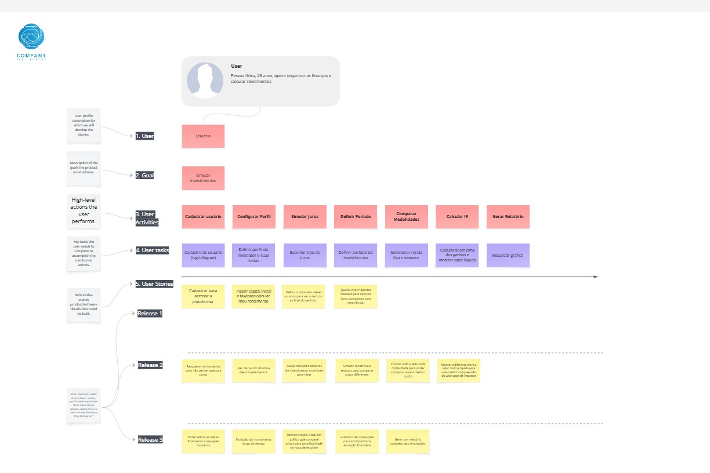

# Visão Geral da Arquitetura — SimulaInvest Desktop

## 1. Descrição do Sistema

O SimulaInvest Desktop é uma aplicação desktop desenvolvida em Java para auxiliar usuários com dificuldades matemáticas e organizacionais no cálculo de juros compostos, projeção de rendimentos e comparação de modalidades de investimento de médio e longo prazo.

A aplicação opera integralmente de forma offline, sem dependência de APIs externas ou integração com corretoras em tempo real.

---

## 2. Estilo Arquitetural

O sistema adota o padrão de Arquitetura em Camadas (Layered Architecture), promovendo a separação entre interface, regras de negócio e persistência de dados.

Essa abordagem favorece a manutenção, a escalabilidade e a organização do código-fonte.

---

## 3. Camadas do Sistema

### 3.1 Camada de Apresentação (JavaFX)

Responsável pela interação com o usuário, incluindo:

* Interfaces gráficas desenvolvidas em FXML;
* Captura de eventos e entradas do usuário;
* Exibição dos resultados das simulações e comparações de investimentos.

### 3.2 Camada de Lógica de Negócio (Spring Boot)

Responsável pelo processamento das funcionalidades do sistema:

* Implementação dos serviços de negócio;
* Execução dos cálculos financeiros;
* Processamento das projeções de investimento;
* Aplicação das regras e validações do domínio.

### 3.3 Camada de Persistência (H2/PostgreSQL)

Responsável pelo armazenamento e recuperação dos dados:

* Persistência através de JPA e Hibernate;
* Compatibilidade com H2 para uso embarcado;
* Compatibilidade com PostgreSQL para ambientes mais robustos;
* Gerenciamento automático do esquema de banco de dados pelo Spring Boot.

---

## 4. Fluxo Funcional

O fluxo de execução ocorre da seguinte forma:

1. O usuário informa os dados da simulação na interface JavaFX;
2. As informações são encaminhadas para a camada de lógica de negócio;
3. Os serviços processam cálculos e validações;
4. Os dados necessários são persistidos ou recuperados do banco de dados;
5. Os resultados retornam à camada de negócio;
6. A interface apresenta os valores calculados e os relatórios ao usuário.

Todo o processamento, desde a entrada até a exibição do resultado, deve ser concluído em até cinco segundos.

---

## 5. Principais Componentes

### Views

* Implementadas com JavaFX e FXML;
* Responsáveis pela apresentação das telas.

### Controllers

* Recebem as ações do usuário;
* Intermediam a comunicação entre interface e serviços.

### Services

* Contêm as regras de negócio;
* Executam cálculos financeiros e validações.

### Entities

* Representam as entidades persistidas no banco de dados;
* Mapeadas através de JPA.

### Repositories

* Responsáveis pelas operações de acesso aos dados;
* Implementados com Spring Data JPA.

---

## 6. Modelo de Dados

O sistema possui, no mínimo, oito entidades de negócio.

Entre as principais entidades estão:

* Usuario: armazena informações de acesso e perfil do usuário;
* Simulacao: registra parâmetros e resultados das simulações realizadas;
* PerfilInvestimento: representa as modalidades de investimento cadastradas.

Relacionamentos principais:

* Um usuário pode possuir diversas simulações;
* As entidades são relacionadas por meio de associações JPA;
* Senhas e informações sensíveis são armazenadas utilizando mecanismos de criptografia.

---

## 7. Decisões Técnicas

### JavaFX

Escolhido para o desenvolvimento da interface gráfica por oferecer integração nativa com aplicações desktop Java.

### Spring Boot

Utilizado para estruturar a lógica de negócio, gerenciamento de dependências e organização dos serviços.

### H2 e PostgreSQL

A combinação permite utilizar um banco embarcado para distribuição simplificada e um banco robusto para cenários mais complexos.

### Spring Data JPA

Fornece abstração da camada de persistência e reduz a quantidade de código necessário para operações de banco de dados.

### Operação Offline

Atende ao requisito de disponibilidade do sistema mesmo sem conexão com a internet.

### Link Miro

> Link editavel do miro:
 https://miro.com/welcomeonboard/akZuUEJPTjV2a3pqSi9nbzJSS1JaaDNhbktJRmc3SFZWVitvTFdzRDRZbElsNDBheURCWjlzb1MyUjZsSEUvdGFVd3d4cTVKb24wUGkwV3ViSWN1dkxONlk1RHA5a2tsU0hHWWYzU3lSMjdhL3IvZUt5R2ozRDNEZXFhN0hrTFB0R2lncW1vRmFBVnlLcVJzTmdFdlNRPT0hdjE=?share_link_id=278546317159

> 